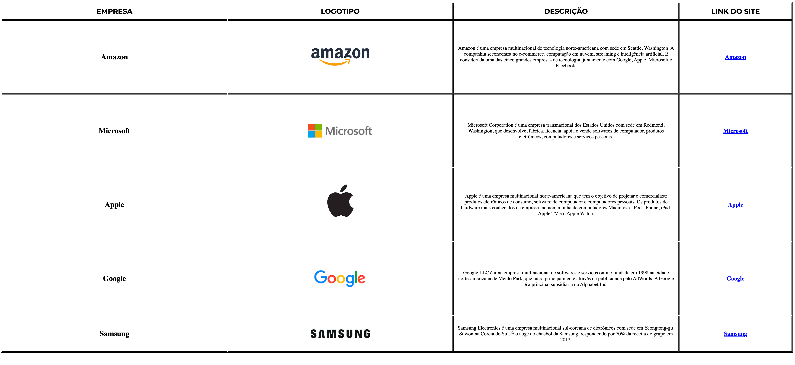

# Landind Page - Let's Go, Pikachu!

---
## Sobre
Bem-vindo ao meu projeto escolar, onde apresento uma tabela detalhada com informações sobre cinco das maiores empresas de tecnologia do mundo: Apple, Google, Amazon, Samsung e Microsoft. Este site foi desenvolvido como parte de um trabalho escolar para oferecer uma visão geral das empresas mais influentes do setor. O objetivo deste projeto é colocar em prática os conhecimentos adquiridos sobre as linguagens de marcação , HTML, CSS e markdown, durante o curso Técnico em Desenvolvimento de Sistemas do [SENAI Jandira](https://sp.senai.br/unidade/jandira/).

---

## O que Você Vai Encontrar
A tabela inclui as seguintes informações para cada empresa:

- Nome: O nome oficial da empresa.
- Logotipo: O logotipo ou ícone representativo da empresa.
- Descrição: Uma breve descrição sobre o que a empresa faz e sua importância no mercado.
- Link do Site: Um link direto para o site oficial da empresa.

---

## Tecnologias utilizadas
- HTML
- CSS
- Markdown
- Git

---

## Autor

- [Giovanna Xavier](https://www.linkedin.com/in/giovanna-xavier-978538241/)